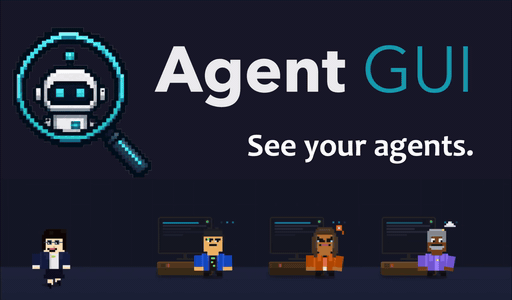

<p align="center">
  
</p>

> AgentGUI: a human-friendly interface for observing and steering AI agents research team. Currently supporting [Hermes](https://github.com/nousresearch/hermes-agent) agents and (experimental) [Claude Agent](https://code.claude.com/docs/en/agent-sdk/overview).


Each task runs as an agent sitting at a desk in a scrollable office. Click a desk to watch its live activity feed, file tree, terminal, and full debug message. Redirect and reassign agents mid-task without leaving the UI.

<p align="center">
  
</p>

---

## Prerequisites

1. **Hermes agent** installed. This version is tested with **v0.15.1**. Verify with:
   ```bash
   hermes --version   # run `hermes update` to upgrade
   ~/.hermes/hermes-agent/venv/bin/python3 -c "from run_agent import AIAgent; print('ok')"
   ```
   If it errors, follow the [Hermes installation guide](https://github.com/nousresearch/hermes-agent).

   Support for other agents is on our roadmap.

2. **Docker** running, with the sandbox image pulled (one-time, ~2.2 GB):
   ```bash
   docker info && docker pull nikolaik/python-nodejs:python3.11-nodejs20
   ```

---

## Step 1: Configure an inference backend

If you already have a working Hermes configuration, and you don't want a specifci profile for the GUI, you can skip this section.


We provide a simple script to get started with cloud (free) or local inference.
Run:
```bash
bash install_profile.sh
```

Press Enter to accept the default (shown in parentheses).

| | ☁️ Gemini API | ☁️ Claude API | 🦙 Ollama | ⚡ vLLM |
| --- | --- | --- | --- | --- |
| **Recommended for** | No GPU, fastest start | No GPU, top-tier agentic quality | Inference on your laptop | Inference on a local server |
| **Input requirements** | API key ([Google AI Studio](https://aistudio.google.com/), free tier) | API key ([Anthropic Console](https://console.anthropic.com/)) | Model name | Model name + endpoint URL |

<details>
<summary><strong>☁️ Gemini API</strong></summary>

1. Create a free API key at [Google AI Studio](https://aistudio.google.com/).
2. Run `bash install_profile.sh`, choose **API (Gemini)**, and paste your key when prompted.
3. Default model is `gemini-3.1-flash-lite` — change it at the prompt, or in AgentGUI app, or later with `hermes -p <profile> model`.
</details>

<details>
<summary><strong>☁️ Claude API</strong></summary>

1. Create an API key at the [Anthropic Console](https://console.anthropic.com/).
2. Run `bash install_profile.sh`, choose **API → Claude (Anthropic)**, and paste your key when prompted (written to the profile's `.env` as `ANTHROPIC_API_KEY`).
3. Default model is `claude-opus-4-8` (best for autonomous agentic work) — change it at the prompt (e.g. `claude-sonnet-4-6` for lower cost/latency), or later with `hermes -p <profile> model`. Hermes uses its native `anthropic` provider, so auxiliary calls (titles, compression, …) run on `claude-haiku-4-5` automatically.
</details>

<details>
<summary><strong>🦙 Ollama</strong></summary>

1. [Install Ollama](https://ollama.com/download) and pull a model, e.g. `ollama pull qwen3.5:4b`.
2. Start the server with these env vars (strongly recommended for inference speed):

   ```bash
   export OLLAMA_FLASH_ATTENTION=1   # ~4× faster prompt eval at large context + halves KV memory
   export OLLAMA_KEEP_ALIVE=60m      # keep the warmed model + primed prefix resident
   ollama serve
   ```

   Add the two `export` lines to your `~/.zshrc` so they survive a restart.
   **Do not** set `OLLAMA_NUM_PARALLEL=2` — a second KV slot makes desks miss the pre-warmed prefix and go cold again.

On top of this, the GUI pre-warms the default model at startup and automatically derives context-capped variants of your Ollama models:

<details id="ollama-the-guictx-model-variants">
<summary><strong>The <code>guictx</code> model variants</strong></summary>

For the Ollama backend, the GUI creates derived models prefixed by guictx65536, e.g. `qwen3.5-4b:guictx65536`. You can see these in `ollama list` and in the GUI's model picker.
They are created since Hermes requires at least a 64K-token context window. However, for a base model and hardware, Ollama's hardware heuristic decides the context length automatically, often resulting either in context window that's too small (sliently truncating prompts) or too large (very slow start). Thus, the GUI derives a variant with `num_ctx 65536`, just above Hermes' floor, for faster and more stable local inference.

For stability, we suggest using the "Chat" version (no tools) for the first time using a base model. Always use the `guictx65536` variant after it is created. A variant shares the base model's weight layers, so it is instant to create and adds no disk. It's safe to `ollama rm` any `:guictx` variant — the GUI re-creates it on next use.


</details>

3. Run `bash install_profile.sh`, choose **Local → Ollama**, and accept the defaults (`http://127.0.0.1:11434/v1`, your model name).

</details>

<details>
<summary><strong>⚡ vLLM</strong></summary>

1. **On the GPU server** — start vLLM (example):

   ```bash
   vllm serve Qwen/Qwen3.6-27B \
     --port 8010 \
     --tensor-parallel-size 1 \
     --enable-auto-tool-choice \
     --tool-call-parser qwen3_coder \
     --reasoning-parser qwen3 \
     --enable-prefix-caching
   ```

2. **On your laptop** — tunnel the remote port to localhost:

   ```bash
   ssh -L 8010:127.0.0.1:8010 <username>@<server-address>
   ```

3. Run `bash install_profile.sh`, choose **Local → vLLM**, and enter `http://127.0.0.1:8010/v1` plus the model name (e.g. `Qwen/Qwen3.6-27B`).

</details>

**Web search:** the `web_search` tool needs a [Brave Search API key](https://brave.com/search/api/) (free tier is available).
 

```bash
echo "BRAVE_SEARCH_API_KEY=<key>" >> ~/.hermes/profiles/<profile>/.env
```

### Finer agent profile control
The script above installs hermes agent profiles. To customize tools, model, and other config, see [Agent profile customization](DEVELOPER_NOTES.md#agent-profile-customization) in the developer notes.

---

## Step 2: Ensure best-practice Hermes config and local inference setting

If you didn't configure a Hermes profile using the script provided above, please read the following:

**Stop containers from piling up.** Hermes spawns a fresh sandbox after ~5 min idle by default. Pin the lifetime to 24 h in `~/.hermes/config.yaml` so the same container is reused:

```yaml
# ~/.hermes/config.yaml
terminal:
  lifetime_seconds: 86400   # default was 300
```

We also recommend setting terminal.timeout higher than the default 300s to avoid works that run long training scripts from being killed. For example, set it to 30mins:
```yaml
terminal:
  timeout: 1800   # default was 300
```
Note that this is the default setting used by our `install_profile.sh` script.

If you are using existing Ollama backend, please ensure you start your Ollama server using the following environment arguments:

```bash
export OLLAMA_FLASH_ATTENTION=1   # ~4× faster prompt eval at large context + halves KV memory
export OLLAMA_KEEP_ALIVE=60m      # keep the warmed model + primed prefix resident
ollama serve
```

Add the two `export` lines to your `~/.zshrc` so they survive a restart.
**Do not** set `OLLAMA_NUM_PARALLEL=2` — a second KV slot makes desks miss the pre-warmed prefix and go cold again.

## Step 3: Install AgentGUI & run

### Automatic (uses conda)

```bash
./start.sh
```

The script
- Builds the `agent-gui` conda env (Python 3.12)
- Installs the Python package,
- Builds the frontend
- Opens **http://localhost:8765**.

Dependency versions are pinned in [pyproject.toml](pyproject.toml) — every install gets the same tested versions.

### Manual setup

**conda**

```bash
conda env create -f environment.yml   # python 3.12 + pinned sqlite, no packages yet
conda activate agent-gui
pip install -e .
```

**venv / uv**

```bash
# stdlib venv
python3 -m venv .venv
source .venv/bin/activate
pip install -e .

# or uv
uv venv .venv
uv pip install -e . --python .venv/bin/python
source .venv/bin/activate
```

**Build frontend and start** (with either env active):

```bash
cd frontend && npm install && npm run build && cd ..
python -m agent_gui
```

---

## Start / stop

Start / stop the app this way:
```bash
./start.sh                           # or: bash dev.sh / python -m agent_gui)
# … work …                           # Ctrl+C in this terminal to stop
./stop.sh                            # fallback if the terminal is gone
docker ps --filter name=hermes-      # you can use docker rm to remove stable containers.
```

For all `./start.sh`, `bash dev.sh`, or `python -m agent_gui` — the server runs in the foreground of that terminal.

**Normal stop: press `Ctrl+C` in the server's terminal.** Please wait for the server to shut down gracefully, as it SIGTERMs all desk workers, waits for them to exit, and then (with the default Docker setting) removes every `hermes-*` sandbox container.

**Fallback: `./stop.sh`.** It stops desk workers, the GUI server, the Vite dev server, and the Ollama daemon (`--keep-ollama` leaves Ollama up). It attempts to make each process exit gracefully, and force-kills after 20s if processes are not exited successfully.

**Dev mode, two-terminal variant** ([option 1 below](#dev-mode-hot-reload)): `Ctrl+C` in each terminal — the backend one triggers the same graceful cleanup.


**What stopping discards vs. keeps.** Removing the sandbox containers only loses what agents installed *inside* them (pip/apt packages — re-installed on next use). Workspace files, `TASK.md`, conversation history, and memories all live on the host and survive any stop. To keep containers warm across restarts instead, toggle **⚙ → Docker → "Keep sandbox containers"** in the app header.

### CLI options

```
--port 8765                   Change port (default 8765)
--hermes-home ~/.hermes       Custom Hermes home directory
--no-open                     Don't auto-open the browser
--workspace-root ~/workspace  Where per-desk working dirs are created
--experimental                Enable developmental features (Claude Agent SDK agent); off by default
```

---

## Using the app

| Element                | Action                                                                                                  |
| ---------------------- | ------------------------------------------------------------------------------------------------------- |
| **+ button**           | Add a new desk (pending task)                                                                            |
| **Desk body**          | Click to open the activity panel (double-click to maximize)                                              |
| **Tasks tab**          | Edit this desk's `TASK.md` (Shift+Enter to save)                                                         |
| **Bed**                | Awake → interrupt + sleep. Sleeping → click a desk to reassign the agent                                 |
| **Bell**               | Wake the agent to the last active desk                                                                   |
| **👥 Agent Profiles**  | Side panel of all profiles — drag an avatar onto a desk to assign/resume, or onto a section to organize  |

> Hard-refresh (Cmd+Shift+R) after updating to pick up new JS bundles.

---

## Using AgentGUI for research

We provide two demo research tasks under [`research_tasks/`](research_tasks/). You can simply drag the directory into `team_files` in the app, copy the task's prompt text into a desk (`task.md` for `model_training/organsmnist`, `agent_prompt.txt` for the `prompt_engineering` tasks), and watch the agent carry out the task.
- For the prompt-tuning (`prompt_engineering/medical_reasoning_api`) API example, a Claude API key needs to be passed inside the docker sandbox. See the note below and the task's `README.md` for details.

> ⚠️ **Research tasks that call a Claude API need the key *inside* the sandbox.** Whichever agent you assign to a task under [`research_tasks/`](research_tasks/) (e.g. `prompt_engineering/medical_reasoning_api`) runs inside its Docker sandbox, so a host-only `ANTHROPIC_API_KEY` is **not** visible to it. You must (1) set `ANTHROPIC_API_KEY` in your environment **and** (2) forward it into the sandbox by adding it to that agent's Hermes profile config:
>
> ```yaml
> terminal:
>   docker_forward_env:
>     - "ANTHROPIC_API_KEY"
> ```

---

## Experimental: Claude Agent SDK agent

> **Off by default — developmental feature.** Enable it with the `--experimental` flag when running `start.sh` or `python -m agent_gui --experimental`; without the flag, the app exposes only the stable Hermes agents.

AgentGUI can optionally run a desk with Anthropic's **Claude Agent SDK** (the `claude-agent-sdk` package that powers Claude Code) instead of a Hermes agent. The desk surfaces the agent's live activity, files, and debug stream just like a Hermes desk — but the agent underneath is Claude Code, not Hermes.

**Enable it**

```bash
# Prerequisites: `pip install claude-agent-sdk` in the GUI env, and the `claude` CLI on your `PATH`.
./start.sh --experimental
# or
python -m agent_gui --experimental
```

A **Claude Agent SDK** agent then shows up in the 👥 Agent Profiles roster (grouped under **API**). Drag it onto a desk — or pick it in the desk's agent picker. The SDK shells out to the `claude` CLI and resolves credentials the way the CLI does: it uses your `claude /login` subscription (or `CLAUDE_CODE_OAUTH_TOKEN` from `claude setup-token`).

The desk is **subscription-only**: AgentGUI strips `ANTHROPIC_API_KEY` (plus `ANTHROPIC_AUTH_TOKEN` and the Bedrock/Vertex/Foundry flags) from the Claude worker's environment, so a stale or wrong API key can't silently *shadow* your login (the CLI's credential precedence is API key > OAuth token > `/login`). To bill Claude usage to an API key instead, run a Hermes desk on a Claude model.


Important notes:
- The Claude Agent SDK agent executes its tools outside of the Hermes docker sandbox. Only use it at work you'd let an agent run on your host directly.
- Despite prevention of API key shadowing, we **strongly recommend** that you unset your inference API keys from your environment when running the Claude Agent SDK agent. This could avoid the agent potentially writing code or making API calls that would incur unwanted costs.
---

## Dev mode (hot-reload)

### Option 1: Run the backend and frontend dev servers separately
```bash
# Terminal 1 — Python backend
python -m agent_gui --no-open
# Terminal 2 — Vite dev server (proxies /api and /ws to :8765)
cd frontend && npm run dev   # → http://localhost:5173
```

### Option 2: Always rebuild frontend and restart the server with one command
```bash
bash dev.sh
```
### Running the tests

```bash
pip install -e ".[dev]"   # pytest + the deps the suite needs
python -m pytest tests/
```
A few tests import the locally installed Hermes agent (`~/.hermes/hermes-agent`), so they need the [Hermes prerequisite](#prerequisites) in place.

---

---

## Contributors

### Software Development
- Allen (Xuan) Zhao, Michael Moor

### Concept & Ideation
- Michael Moor, Allen Zhao, Jiwoong Sohn

### Technical Investigation & Diagnostics
- Allen Zhao, Qinyue Zheng, Lorenzo Menarbin

### Testing & User Feedback
- Allen Zhao, Michael Moor, Ashraya Indrakanti, Jiwoong Sohn, Qinyue Zheng, Yulun Jiang, Lorenzo Menarbin, Johann Lieberwirth

---

## Citation

If you use AgentGUI in your research, please cite:

```bibtex
@software{eth_medical_ai_lab_2026_agent_gui,
  author       = {{ETH Zurich, Medical AI Lab}},
  title        = {AgentGUI: a human-friendly interface for observing and steering AI agents},
  year         = {2026},
  month        = jun,
  version      = {0.1.0},
  url          = {https://github.com/eth-medical-ai-lab/agent-gui},
  license      = {MIT}
}
```